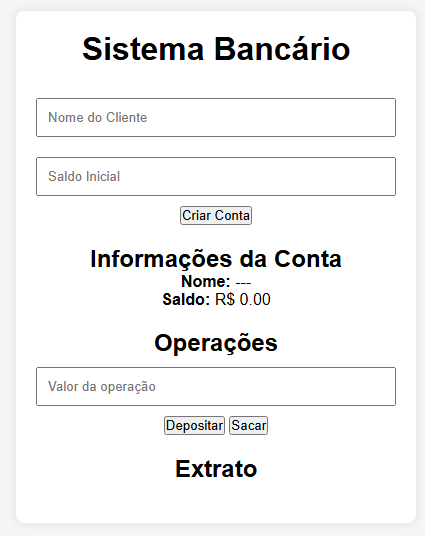

# Sistema Bancário - Projeto

Este é um sistema bancário simples desenvolvido utilizando **JavaScript**, **HTML** e **CSS**. O objetivo do projeto é permitir a criação de contas bancárias, depósitos, saques e visualização do extrato, tudo isso com base no conceito de **orientação a objetos**.

## Funcionalidades

- **Criar Conta Bancária**: O usuário pode criar uma conta informando o nome e o saldo inicial.
- **Depositar**: O usuário pode realizar depósitos na conta, que são adicionados ao saldo.
- **Sacar**: O usuário pode sacar um valor da conta, desde que haja saldo suficiente.
- **Extrato**: A cada depósito ou saque, o histórico de transações é atualizado e exibido.

## Tecnologias Utilizadas

- **HTML**: Para estruturação do conteúdo da página.
- **CSS**: Para estilização e formatação visual.
- **JavaScript**: Para manipulação de dados e lógica de negócios (orientação a objetos).

## Como Usar

1. Clone este repositório ou baixe os arquivos.
2. Abra o arquivo `index.html` no seu navegador.
3. A página carregará o formulário para criação de conta, operações de depósito e saque, e o histórico de transações.
4. Preencha o nome do cliente e o saldo inicial para criar uma conta.
5. Faça depósitos e saques utilizando os campos apropriados e veja o saldo sendo atualizado em tempo real.

## Estrutura do Projeto

### **HTML**

A estrutura HTML do projeto contém os seguintes elementos:

- **Formulário de Criação de Conta**: Inputs para o nome do cliente e saldo inicial, junto com um botão para criar a conta.
- **Área de Informações da Conta**: Exibe o nome e o saldo da conta após sua criação.
- **Área de Transações**: Contém os campos para realizar depósitos e saques.
- **Extrato**: Exibe o histórico de transações realizadas.

### **CSS**

O arquivo CSS contém a estilização da página, incluindo a formatação da conta bancária, áreas de transações e extrato. O design é simples e responsivo, para garantir que o sistema funcione bem em dispositivos móveis e desktops.

### **JavaScript**

A lógica do sistema bancário é implementada utilizando uma classe `Contabancaria` em JavaScript. A classe possui os seguintes métodos principais:

- **`eventoCriarConta()`**: Responsável por criar a conta bancária, exibindo o nome e o saldo inicial.
- **`depositarConta()`**: Adiciona o valor depositado ao saldo atual e atualiza o extrato com a transação.
- **`sacarConta()`**: Permite ao usuário sacar um valor, verificando se há saldo suficiente, e atualiza o saldo e o extrato.

## Como Contribuir

1. Faça um fork deste repositório.
2. Crie uma branch para a sua modificação (`git checkout -b minha-modificacao`).
3. Faça suas alterações e commit (`git commit -am 'Adiciona nova funcionalidade'`).
4. Envie para o repositório remoto (`git push origin minha-modificacao`).
5. Abra um pull request.

## Licença

Este projeto está licenciado sob a Licença MIT - consulte o arquivo [LICENSE](LICENSE) para mais detalhes.

---

### Imagem do Sistema

### Copie o link a baixo para testar o Sistema
`https://aleckdevv.github.io/projeto-sistema-banc-rio-orientado-objetos/`
---

**Desenvolvedor**: [Alex Soares Lopes]  
**Data de criação**: Março de 2025  
**Tecnologias**: HTML5, CSS3, JavaScript ES6+
